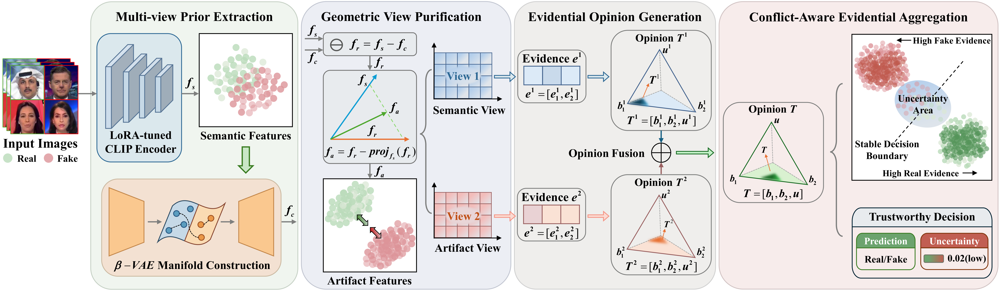
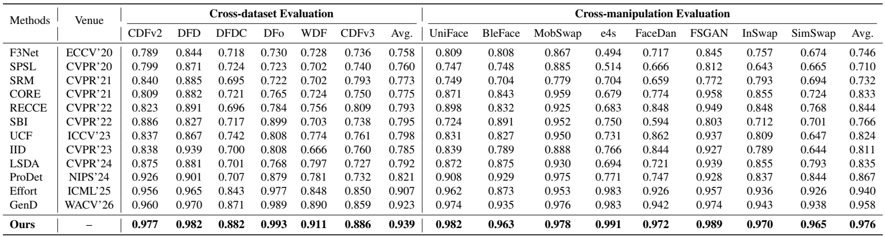

<div align="center">

# Divide and Conquer: Reliable Multi-View Evidential Learning for Deepfake Detection

[](#)&nbsp;&nbsp;&nbsp;
[](https://arxiv.org/abs/2606.01885)&nbsp;&nbsp;&nbsp;
[](https://huggingface.co/kxl0825/DiCoME/tree/main)&nbsp;&nbsp;&nbsp;
[](#-citation)&nbsp;&nbsp;&nbsp;
[](https://creativecommons.org/licenses/by-nc/4.0/)

</div>
<div align="center">
  
</div>

---

## 📢 News

- **2026-05-01** Our paper is accepted by **ICML 2026**.
- **2026-06-02** Release arXiv preprint.
- **2026-06-01** Release code and pretrained checkpoint for **DiCoME**.

---

## ⚙️ Requirements

```bash
# create virtual environment
conda create -n dicome python=3.12.3
conda activate dicome

# install dependencies
pip install -r requirements.txt
```

Verified with:

* `torch==2.6.0+cu118`
* `torchvision==0.21.0+cu118`
* `lightning==2.5.0`
* `transformers==4.50.0`
* `peft==0.14.0`

> Install a PyTorch build matching your CUDA version if CUDA 11.8 is not suitable.

---

## 📦 Checkpoints for DiCoME

| 📊 **Model** | 🪣 **Download** | 📄 **Local Path** |
|-------------|------------------|-------------------|
| `DiCoME` | [Hugging Face](https://huggingface.co/kxl0825/DiCoME/blob/main/dicome-best.ckpt) | `weights/dicome-best.ckpt` |

Download `dicome-best.ckpt` and place it at:

```text
weights/dicome-best.ckpt
```

---

## 📂 Datasets

Our evaluation follows [DeepfakeBench](https://github.com/SCLBD/DeepfakeBench). Cross-dataset evaluation uses CDFv2, DFD, DFDC, DFo, WDF, and [CDFv3](https://github.com/OUC-VAS/Celeb-DF-PP). Cross-manipulation evaluation uses [DF40](https://github.com/YZY-stack/DF40).

### Dataset Preparation

**1. Download datasets from the official sources.**

Download each benchmark from its official source and follow its license terms.

**2. Convert image folders to H5 format.**

```bash
python tools/data/folder_to_h5_dataset.py --image_root /path/to/frames --output_h5 data/h5/test.h5
```

Default H5 paths:

```yaml
trn_h5_path: data/h5/train.h5
val_h5_path: data/h5/val.h5
tst_h5_path: data/h5/test.h5
```

**3. Generate txt split files for each dataset.**

```bash
python tools/data/h5_to_split_txt.py --h5_path data/h5/test.h5 --output_dir data/splits/test --group_index 1
```

Expected structure:

```text
data/
├── h5/
│   ├── train.h5
│   ├── val.h5
│   └── test.h5
└── splits/
    ├── train/
    ├── val/
    └── test/
```

### Split File Format

Use separate txt files for real and fake samples. Each line must match an H5 key:

```text
DatasetName/fake/.../frame.png
DatasetName/real/.../frame.png
```

```text
CDFv2/Celeb-synthesis/id0_id16_0003/000.png
CDFv2/Celeb-synthesis/id0_id16_0003/017.png
CDFv2/Celeb-real/id0_0001/000.png
CDFv2/Celeb-real/id0_0001/009.png
```

Large H5 datasets are not included in this repository.

---

## 📊 Main Results

The following tables summarize the main results reported in our paper.
Please refer to the paper for full details.

<div align="center">
  
</div>


---

## 🧪 Minimal Example without External Data

This repository includes a tiny CDFv2-style demo frame set under `demo/frames`.

### Check Code and Configuration

```bash
python -m compileall -q src tools
python -c "from src.config import load_config; cfg = load_config('src/config/dicome_default.yaml'); print(cfg)"
```

### Prepare the Tiny Local Demo Dataset

Demo layout:

```text
demo/frames/CDFv2/Celeb-synthesis/id0_id16_0003/000.png
demo/frames/CDFv2/Celeb-real/id0_0001/000.png
demo/frames/CDFv2/YouTube-real/00011/000.png
```

```bash
python tools/data/folder_to_h5_dataset.py --image_root demo/frames --output_h5 data/h5/test.h5 --overwrite

python tools/data/h5_to_split_txt.py --h5_path data/h5/test.h5 --output_dir data/splits/test/CDFv2 --group_index 1
```

Set test fields:

```yaml
tst_h5_path: data/h5/test.h5
tst_files:
  CDFv2:
  - data/splits/test/CDFv2/Celeb-synthesis.txt
  - data/splits/test/CDFv2/Celeb-real.txt
  - data/splits/test/CDFv2/YouTube-real.txt
```

### Test Example with Released Checkpoint

Place the checkpoint at:

```text
weights/dicome-best.ckpt
```

```bash
python tools/train/train_dicome.py test weights/dicome-best.ckpt --config_path src/config/dicome_default.yaml
```

---
## 🚀 Full Training

All training options are configured in:

```text
src/config/dicome_default.yaml
```

Key options:

```yaml
backbone: openai/clip-vit-large-patch14
feature_dim: 64
batch_size: 128
mini_batch_size: 128
max_epochs: 20
dicome_epochs: 20
dicome_learning_rate: 0.0001
beta_kld: 2.0
lambda_align: 1.0
lambda_vae: 0.7
```

The training entry point is `tools/train/train_dicome.py`. Use `fit` for training and `test` for evaluation:

```bash
# train
python tools/train/train_dicome.py fit --config_path src/config/dicome_default.yaml

# test
python tools/train/train_dicome.py test weights/dicome-best.ckpt --config_path src/config/dicome_default.yaml
```

---

## 📊 Evaluation

Place the checkpoint at:

```text
weights/dicome-best.ckpt
```

Testing is controlled by `tst_h5_path` and `tst_files` in `src/config/dicome_default.yaml`. H5 filenames are user-defined; the txt entries only need to match the keys inside the corresponding H5 file.

### Test a Single Dataset

For example, to evaluate CDFv2:

```yaml
tst_h5_path: data/h5/CDFv2.h5
tst_files:
  CDFv2:
  - data/splits/test/CDFv2/Celeb-synthesis.txt
  - data/splits/test/CDFv2/Celeb-real.txt
  - data/splits/test/CDFv2/YouTube-real.txt
```

Clean layout:

```text
data/
├── h5/
│   └── CDFv2.h5
└── splits/
    └── test/
        └── CDFv2/
            ├── Celeb-synthesis.txt
            ├── Celeb-real.txt
            └── YouTube-real.txt
```

```bash
python tools/train/train_dicome.py test weights/dicome-best.ckpt --config_path src/config/dicome_default.yaml
```

### Test Multiple Datasets Together

For multiple datasets, give each dataset its own H5 path and split folder:

```yaml
tst_h5_path:
  CDFv2: data/h5/CDFv2.h5
  DFD: data/h5/DFD.h5
tst_files:
  CDFv2:
  - data/splits/test/CDFv2/Celeb-synthesis.txt
  - data/splits/test/CDFv2/Celeb-real.txt
  - data/splits/test/CDFv2/YouTube-real.txt
  DFD:
  - data/splits/test/DFD/fake.txt
  - data/splits/test/DFD/real.txt
```

This runs one combined evaluation over the listed datasets. For paper-style reporting, test each dataset separately.

Prediction CSV files are saved under `runs/`.

---

## 📜 Citation

If you use or extend our work, please cite:

```bibtex
@misc{kang2026divideconquerreliablemultiview,
  title={Divide and Conquer: Reliable Multi-View Evidential Learning for Deepfake Detection},
  author={Xiaolu Kang and Zhongyuan Wang and Jikang Cheng and Baojin Huang and Zhanhe Lei and Gang Wu and Qin Zou and Qian Wang},
  year={2026},
  eprint={2606.01885},
  archivePrefix={arXiv},
  primaryClass={cs.CV},
  url={https://arxiv.org/abs/2606.01885}
}
```

---

## 🙏 Acknowledgements

* [GenD](https://github.com/yermandy/GenD) for code organization and implementation references.
* [DeepfakeBench](https://github.com/SCLBD/DeepfakeBench), [DF40](https://github.com/YZY-stack/DF40), and [CDFv3](https://github.com/OUC-VAS/Celeb-DF-PP) for dataset support.
